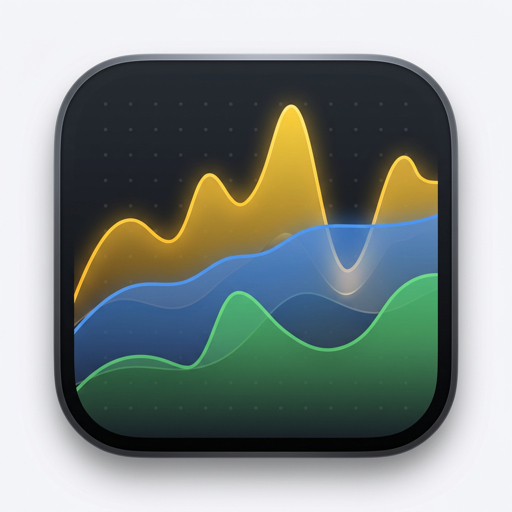
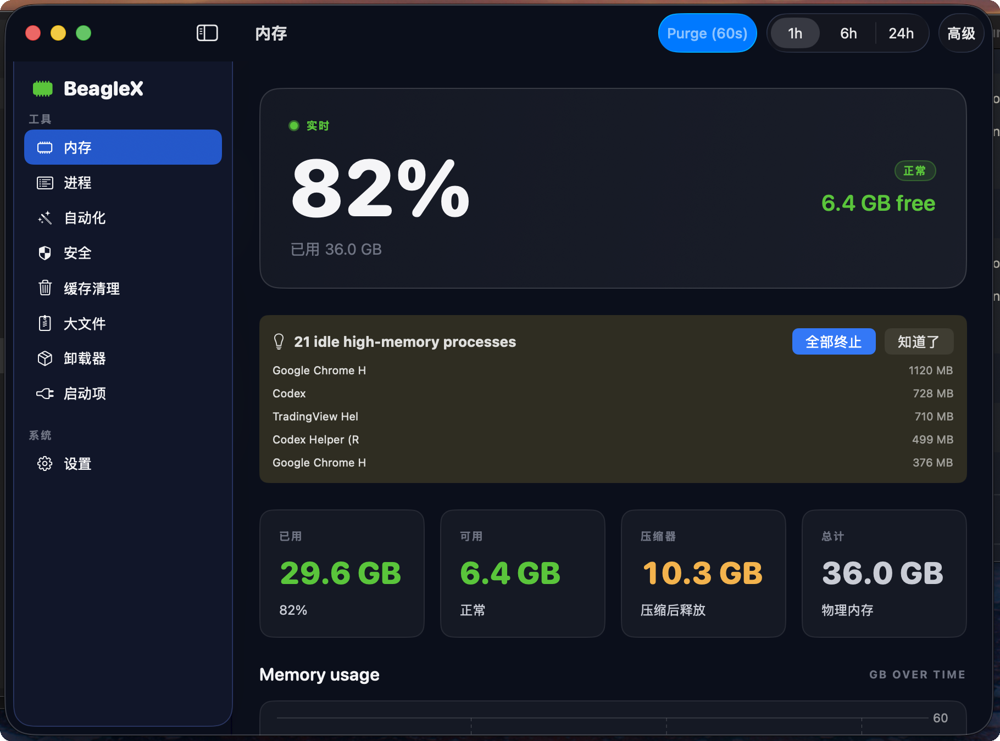
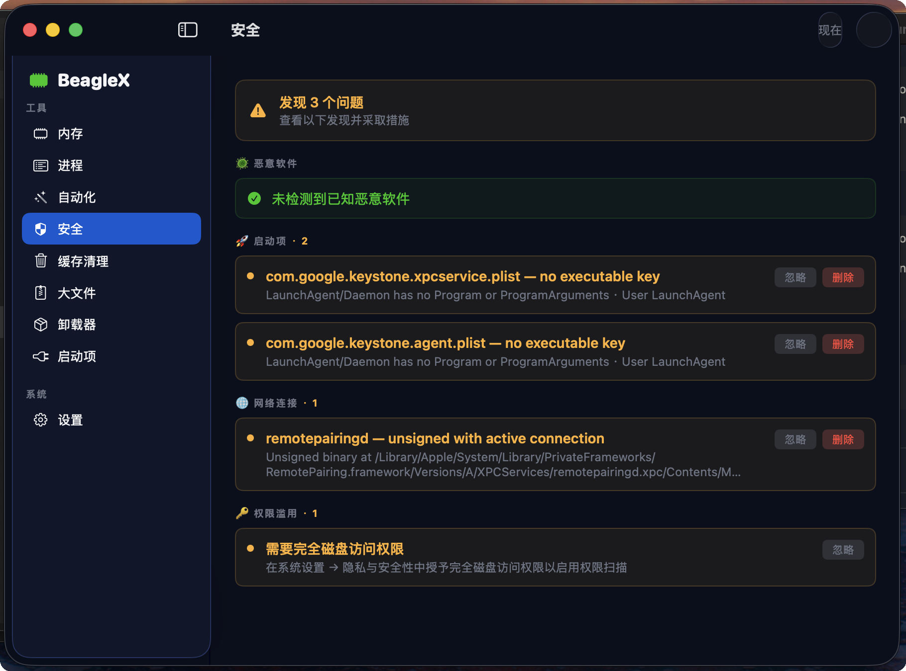
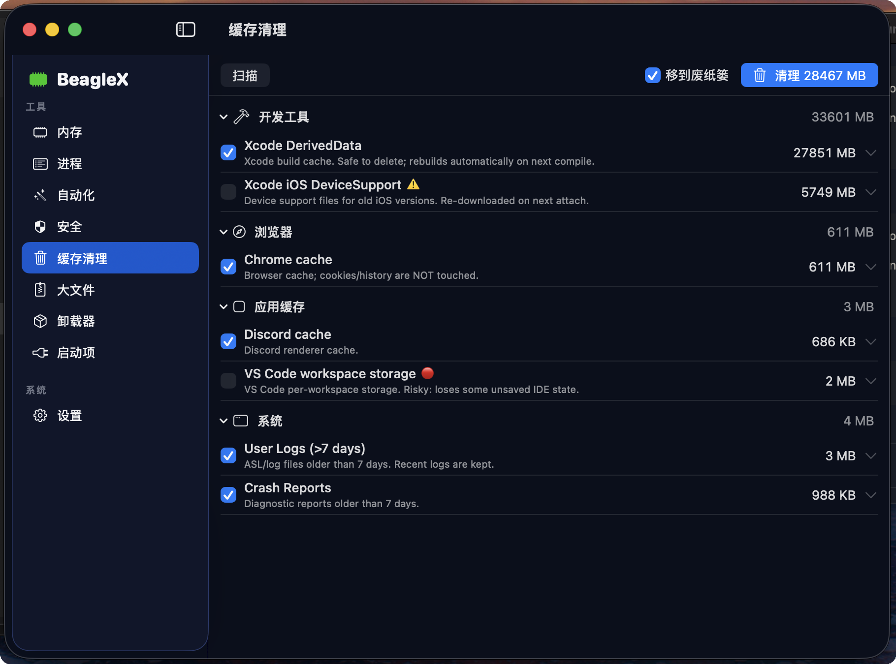

# RamKiller

> A native macOS memory cleaner, security scanner, and system monitor — built with SwiftUI.

<p align="center">
  
</p>

<p align="center">
  <a href="https://github.com/vegadrift007-arch/ramkiller-mac/releases/latest">
    
  </a>
  
  
  
</p>

---

## What is RamKiller?

RamKiller is an all-in-one macOS utility for keeping your Mac fast and safe. It combines real-time memory monitoring, intelligent process killing, security scanning, and disk cleanup — all in a native SwiftUI app that respects your privacy (fully offline).

## Features

### 🧠 Memory Monitor
- Real-time RAM usage, pressure level, swap activity
- Top processes by memory consumption
- One-click memory purge (via privileged helper)
- Live menu bar widget showing CPU / RAM / network

### 🛡️ Security Scanner (new in 1.6)
- Detects known macOS malware (20+ families: Shlayer, Adload, Pirrit, KeRanger, XCSSET, etc.)
- Flags unsigned launch agents and daemons
- Identifies unsigned processes with active network connections
- Catches apps abusing TCC permissions (Full Disk Access, Microphone, Camera, Screen Recording)
- Manual or scheduled (daily / weekly) scanning, fully offline
- One-click quarantine to Trash

### 🤖 Smart Automation
- Auto-purge memory when pressure exceeds threshold
- Configurable warning / critical / emergency alert levels
- Smart kill suggestions for idle high-memory processes
- Process history and pressure timeline charts

### 🧹 Cache & Disk Tools
- Cache cleaner with curated knowledge base (30+ apps)
- Large file finder
- Duplicate file scanner
- Full app uninstaller (removes app + leftover preferences, caches, support files)
- Launch item manager (LaunchAgents / LaunchDaemons / Login Items)

### 🌍 Localization
- English
- 简体中文

## Screenshots

| Memory monitor | Security scanner |
|---|---|
|  |  |

| Menu bar widget | Cache cleaner |
|---|---|
|  |  |

<sub>To regenerate screenshots: drop PNGs into `docs/screenshots/` matching the filenames above.</sub>

## Installation

### Option 1: Download the signed DMG (recommended)
1. Download [`RamKiller-1.6.0.dmg`](https://github.com/vegadrift007-arch/ramkiller-mac/releases/latest) from the latest release.
2. Open the DMG and drag **RamKiller.app** into your Applications folder.
3. Launch it — Gatekeeper will accept it as **Notarized by Apple Developer ID**.

### Option 2: Build from source
```bash
git clone https://github.com/vegadrift007-arch/ramkiller-mac.git
cd ramkiller-mac
open RamKiller.xcodeproj
```
Build target `RamKiller` for **My Mac**, requires Xcode 16+ and macOS 14.4+.

## Requirements

- macOS **14.4 or later** (Sonoma, Sequoia, Tahoe)
- Apple Silicon or Intel
- For the **Privileged Helper** features (memory purge, system process kill, system launch item management): user approval in System Settings → Login Items
- For **TCC permission scanning**: Full Disk Access (System Settings → Privacy & Security)

## Architecture

```
RamKillerApp
├── SamplingCoordinator      — 2s memory + 60s process sampling
├── SecurityScanCoordinator  — orchestrates 4 parallel security checks
├── HelperBridge             — XPC to privileged helper for system-level ops
└── SwiftData                — historical pressure / process snapshots

Helper (com.vannaq.RamKillerHelper)
├── PurgeOperation
├── KillOperation
├── LaunchItemOperation
├── AppBundleOperation
└── PkgReceiptOperation
```

### Key design choices
- **Fully offline** — no network calls, no analytics, no remote dependencies
- **Privileged helper isolation** — destructive system operations run in a tiny separate XPC binary
- **SwiftUI + AppKit interop** — uses `NSPanel` for the floating menu bar widget, `NSStatusItem` for stats
- **SwiftData** for historical timeline persistence with retention pruning

## Project Structure

```
RamKiller/                  — main app source
  App/                      — AppDelegate
  Core/                     — services, models, utilities
  Features/                 — feature modules (Monitoring, Security, etc.)
  UI/                       — shared UI components, theme
  Resources/                — assets, threat signatures, localization
RamKillerHelper/            — privileged XPC helper tool
RamKillerTests/             — unit tests
Shared/                     — Swift package shared between app & helper
docs/                       — design specs & implementation plans
```

## Contributing

Pull requests welcome. Please open an issue first for any major change so we can discuss the approach.

## License

[GNU General Public License v3.0](LICENSE) — see `LICENSE` for the full text.

You may use, modify, and redistribute this software under the GPL v3, which requires derivative works to be released under the same license.

## Acknowledgements

Built with [Claude Code](https://claude.com/claude-code).

---

**Privacy:** RamKiller never makes network requests. All scanning is performed locally against the bundled threat signature database. Your Mac's data stays on your Mac.
