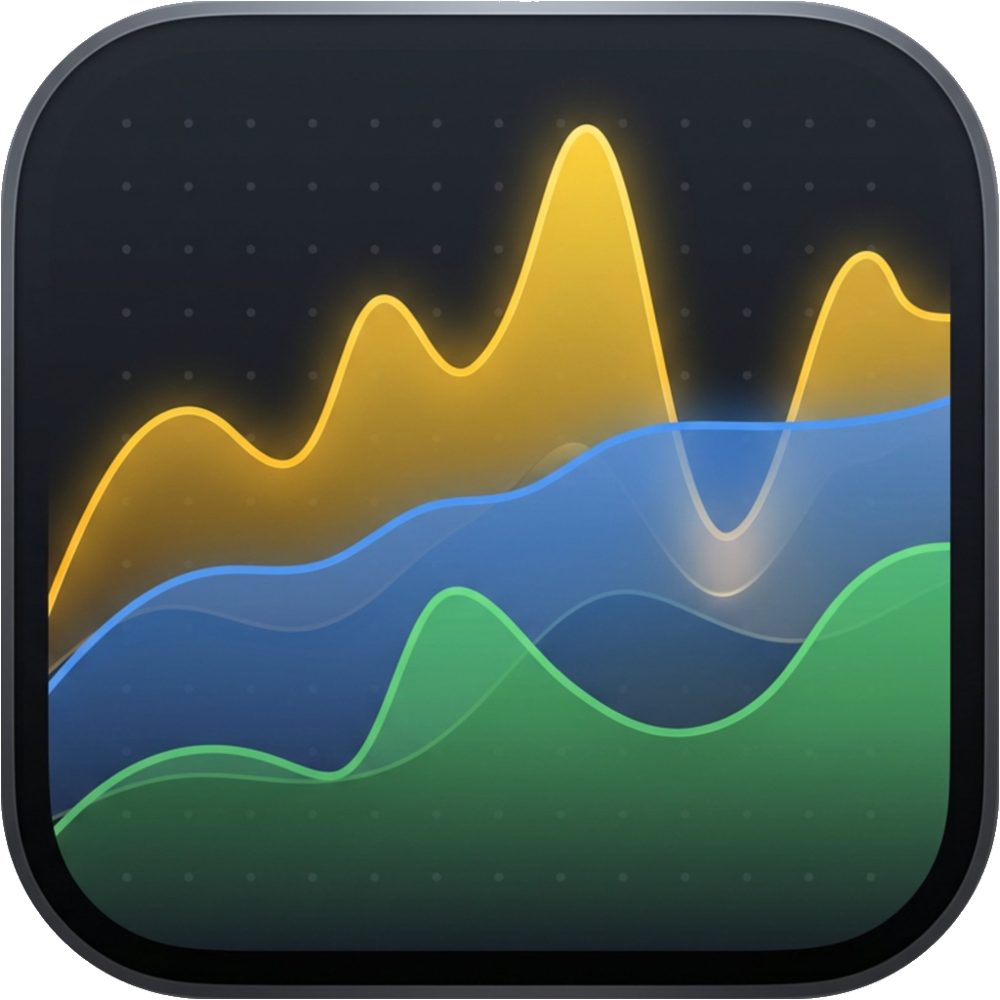

# RamKiller

> A native macOS memory cleaner, security scanner, and system monitor — built with SwiftUI.
> 一款原生 macOS 内存清理、安全扫描和系统监控工具 — 用 SwiftUI 构建。

<p align="center">
  
</p>

<p align="center">
  <a href="https://github.com/vegadrift007-arch/ramkiller-mac/releases/latest">
    
  </a>
  
  
  
</p>

---

## What is RamKiller? / 这是什么？

RamKiller is an all-in-one macOS utility for keeping your Mac fast and safe. It combines real-time memory monitoring, intelligent process killing, security scanning, and disk cleanup — all in a native SwiftUI app that respects your privacy (fully offline).

RamKiller 是一款让你的 Mac 保持流畅和安全的 macOS 综合工具。它整合了实时内存监控、智能进程终止、安全扫描和磁盘清理 — 一款保护你隐私的原生 SwiftUI 应用（完全离线运行）。

## Features / 功能

### 🧠 Memory Monitor / 内存监控
- Real-time RAM usage, pressure level, swap activity
  实时显示 RAM 使用率、压力等级、交换活动
- Top processes by memory consumption
  按内存占用排序的进程列表
- One-click memory purge (via privileged helper)
  一键释放内存（通过特权助手）
- Live menu bar widget showing CPU / RAM / network
  菜单栏实时小部件，显示 CPU / RAM / 网络

### 🛡️ Security Scanner / 安全扫描器 (new in 1.6 / 1.6 新增)
- Detects known macOS malware (20+ families: Shlayer, Adload, Pirrit, KeRanger, XCSSET, etc.)
  检测已知 macOS 恶意软件（20+ 个家族：Shlayer、Adload、Pirrit、KeRanger、XCSSET 等）
- Flags unsigned launch agents and daemons
  标记未签名的启动代理和守护进程
- Identifies unsigned processes with active network connections
  识别有活跃网络连接的未签名进程
- Catches apps abusing TCC permissions (Full Disk Access, Microphone, Camera, Screen Recording)
  检测滥用 TCC 权限的应用（完全磁盘访问、麦克风、摄像头、屏幕录制）
- Manual or scheduled (daily / weekly) scanning, fully offline
  支持手动或定时（每天 / 每周）扫描，完全离线
- One-click quarantine to Trash
  一键移到废纸篓隔离

### 🤖 Smart Automation / 智能自动化
- Auto-purge memory when pressure exceeds threshold
  内存压力超阈值时自动释放
- Configurable warning / critical / emergency alert levels
  可配置的警告 / 严重 / 紧急三级警报
- Smart kill suggestions for idle high-memory processes
  对空闲高内存进程提供智能终止建议
- Process history and pressure timeline charts
  进程历史和内存压力时间线图表

### 🧹 Cache & Disk Tools / 缓存与磁盘工具
- Cache cleaner with curated knowledge base (30+ apps)
  缓存清理器，内置 30+ 个应用的清理规则
- Large file finder
  大文件查找器
- Duplicate file scanner
  重复文件扫描器
- Full app uninstaller (removes app + leftover preferences, caches, support files)
  完整应用卸载器（移除应用 + 残留的偏好设置、缓存、支持文件）
- Launch item manager (LaunchAgents / LaunchDaemons / Login Items)
  启动项管理器（LaunchAgents / LaunchDaemons / 登录项）

### 🌍 Localization / 多语言
- English
- 简体中文

## Screenshots / 截图

| Memory monitor / 内存监控 | Security scanner / 安全扫描 |
|---|---|
|  |  |

| Menu bar widget / 菜单栏小部件 | Cache cleaner / 缓存清理 |
|---|---|
|  |  |

## Installation / 安装

### Option 1: Download the signed DMG (recommended) / 方式一：下载已签名 DMG（推荐）
1. Download [`RamKiller-1.6.0.dmg`](https://github.com/vegadrift007-arch/ramkiller-mac/releases/latest) from the latest release.
   从最新 release 下载 [`RamKiller-1.6.0.dmg`](https://github.com/vegadrift007-arch/ramkiller-mac/releases/latest)。
2. Open the DMG and drag **RamKiller.app** into your Applications folder.
   打开 DMG，把 **RamKiller.app** 拖到 Applications 文件夹。
3. Launch it — Gatekeeper will accept it as **Notarized by Apple Developer ID**.
   启动 — Gatekeeper 会识别为 **Apple Developer ID 公证** 应用。

### Option 2: Build from source / 方式二：从源码构建
```bash
git clone https://github.com/vegadrift007-arch/ramkiller-mac.git
cd ramkiller-mac
open RamKiller.xcodeproj
```
Build target `RamKiller` for **My Mac**, requires Xcode 16+ and macOS 14.4+.

构建 `RamKiller` target 选择 **My Mac**，需要 Xcode 16+ 和 macOS 14.4+。

## Requirements / 系统要求

- macOS **14.4 or later** (Sonoma, Sequoia, Tahoe)
  macOS **14.4 或更高版本**（Sonoma、Sequoia、Tahoe）
- Apple Silicon or Intel
  Apple Silicon 或 Intel 处理器
- For the **Privileged Helper** features (memory purge, system process kill, system launch item management): user approval in System Settings → Login Items
  **特权助手** 功能（内存释放、终止系统进程、管理系统启动项）需在 系统设置 → 登录项 中授权
- For **TCC permission scanning**: Full Disk Access (System Settings → Privacy & Security)
  **TCC 权限扫描** 需要完全磁盘访问权限（系统设置 → 隐私与安全性）

## Architecture / 架构

```
RamKillerApp
├── SamplingCoordinator      — 2s memory + 60s process sampling
├── SecurityScanCoordinator  — orchestrates 4 parallel security checks
├── HelperBridge             — XPC to privileged helper for system-level ops
└── SwiftData                — historical pressure / process snapshots

Helper (com.vannaq.RamKillerHelper)
├── PurgeOperation
├── KillOperation
├── LaunchItemOperation
├── AppBundleOperation
└── PkgReceiptOperation
```

### Key design choices / 关键设计选择
- **Fully offline** — no network calls, no analytics, no remote dependencies
  **完全离线** — 不发起网络请求，没有埋点统计，不依赖远程服务
- **Privileged helper isolation** — destructive system operations run in a tiny separate XPC binary
  **特权助手隔离** — 破坏性系统操作在一个独立的 XPC 二进制中执行
- **SwiftUI + AppKit interop** — uses `NSPanel` for the floating menu bar widget, `NSStatusItem` for stats
  **SwiftUI + AppKit 互操作** — 用 `NSPanel` 做浮动菜单栏小部件，用 `NSStatusItem` 展示统计
- **SwiftData** for historical timeline persistence with retention pruning
  **SwiftData** 持久化历史时间线数据，带保留策略自动清理

## Project Structure / 项目结构

```
RamKiller/                  — main app source / 主应用源码
  App/                      — AppDelegate
  Core/                     — services, models, utilities / 服务、模型、工具
  Features/                 — feature modules (Monitoring, Security, etc.) / 功能模块
  UI/                       — shared UI components, theme / 共享 UI 组件和主题
  Resources/                — assets, threat signatures, localization / 资源、威胁特征库、本地化
RamKillerHelper/            — privileged XPC helper tool / 特权 XPC 助手
RamKillerTests/             — unit tests / 单元测试
Shared/                     — Swift package shared between app & helper / 应用与助手共享的 Swift 包
docs/                       — design specs & implementation plans / 设计文档与实现计划
```

## Contributing / 贡献

Pull requests welcome. Please open an issue first for any major change so we can discuss the approach.

欢迎提交 PR。重大改动请先开 issue 讨论方案。

## License / 许可证

[GNU General Public License v3.0](LICENSE) — see `LICENSE` for the full text.

[GNU 通用公共许可证 v3.0](LICENSE) — 完整文本见 `LICENSE`。

You may use, modify, and redistribute this software under the GPL v3, which requires derivative works to be released under the same license.

你可以在 GPL v3 下使用、修改和重新分发本软件，衍生作品必须以同样的许可证发布。

## Acknowledgements / 致谢

Built with [Claude Code](https://claude.com/claude-code).
基于 [Claude Code](https://claude.com/claude-code) 构建。

---

**Privacy / 隐私：** RamKiller never makes network requests. All scanning is performed locally against the bundled threat signature database. Your Mac's data stays on your Mac.

RamKiller 从不发起网络请求。所有扫描都在本地针对内置的威胁特征库进行。你的 Mac 数据永远留在你的 Mac 上。
